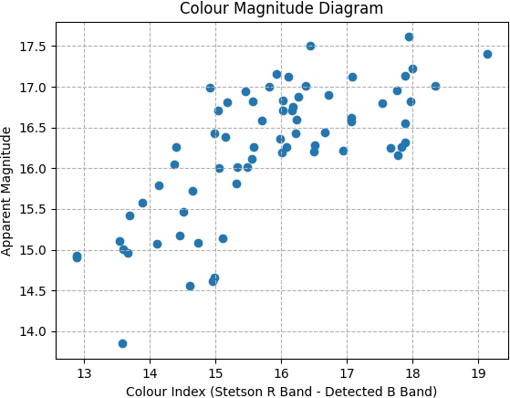
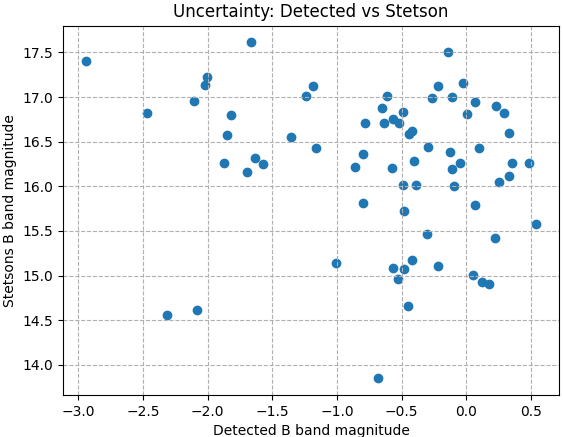

# Seeking Globular Clusters: M2 and Future Observations

This repository contains the data analysis pipeline and the resulting data for the research paper titled "Seeking Globular Clusters: M2 and Future Observations." The study involves detailed observations of the Messier 2 (M2) globular cluster using customized Python scripts to process raw images and derive significant results.

## Table of Contents

- [Introduction](#introduction)
- [Data and Methods](#data-and-methods)
  - [Observational Techniques](#observational-techniques)
  - [Data Reduction](#data-reduction)
- [Results](#results)
- [Figures](#figures)
- [Acknowledgements](#acknowledgements)
- [Data Availability](#data-availability)
- [References](#references)

## Introduction

Globular clusters are densely packed groups of stars that provide significant insights into stellar evolution. This study focuses on the globular cluster Messier 2 (M2), aiming to construct a Hertzsprung-Russell (H-R) diagram and estimate the cluster's age.

## Data and Methods

### Observational Techniques

We utilized the Convergent FA12 telescope from AG Optical Systems, equipped with a ZWO ASI6200MM Pro camera, to observe the globular cluster M2. Observations were conducted under clear skies in New Mexico.

### Data Reduction

A customized data reduction pipeline was developed using Python to process raw images. The reduction involved stacking, aligning, and normalizing images, followed by detailed photometric analysis.

## Results

The detailed analysis involved constructing a Hertzsprung-Russell diagram for M2 and estimating the cluster's age. The analysis revealed that the oldest star in M2 has an effective temperature of approximately \(10^3 K\) and an absolute magnitude of \(M_B \approx 16.5\).

## Figures

Here are the figures generated during the study:

### Stetson's Catalog Stars and Detected Peaks

%20and%20Detected(m)%20stars.png)

### CMD from Detected B Band Magnitude

### CMD from Stetson's B and R Band Magnitude

.png)

### Corrected CMD

### HR Diagram from Stetson's B and R Band Magnitude

.png)

### HR Diagram from Detected Magnitude with Correction

### HR Diagram from Detected B Band Magnitude

### Uncertainty in Detected vs Stetson Stars

### Stetson Catalogue Stars Overlayed on Our FITS File

### Images of M2 on a Logarithmic Scale

## Acknowledgements

Thank you to the grant providers for the new telescope in Glenlea, Judy and Jay Anderson for the donated telescope on UManitoba campus, Jade Yeung for the initial draft of the data reduction pipeline, and Ryan Wierckx for gathering data at the site.

## Data Availability

The images were obtained from the UMLearn portal and should be available to students taking ASTR 3070 in the Fall of 2024. The Stetson’s catalogue data was harvested from the Canadian Advanced Network for Astronomical Research (CANFAR). The pipeline code created for this study is available in this repository.

## References

Please refer to the manuscript for a detailed list of references.
